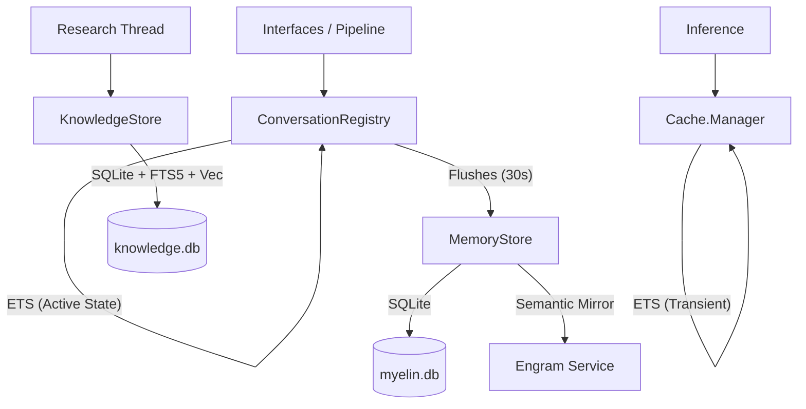

# Persistence & Memory

This document details the persistence and memory architecture of the Myelin system, covering the 3-layer memory architecture, SQLite databases, ETS tables, and external semantic memory integration.

## 1. The 3-Layer Memory Architecture

Myelin organizes memory into three distinct functional layers, moving from hot operational state to cold, objective reference material.

1.  **Layer 1: Operational State (`MemoryStore` & `ConversationRegistry`)**
    - The "here and now." Manages active conversations, hot topics, short-term salience rules, and entity metadata.
    - Heavily relies on ETS for speed and local SQLite (`myelin.db`) for durability across restarts.
    - Highly coupled to the agent's immediate event loop and routing logic.

2.  **Layer 2: Agent Memory (`Myelin.Memory` Behaviour)**
    - The agent's episodic and semantic memory (e.g., past conversations, personal briefings, synthesized thoughts).
    - Pluggable via the `Myelin.Memory` behaviour. Providers implement callbacks for `store/2`, `search/2`, `random_recall/1`, `mark_for_evaluation/2`, and `groom/1`.
    - Includes background grooming via `Myelin.Memory.Grooming` to maintain quality and consolidate memories.
    - Example Implementation: `Myelin.Memory.Engram` (using the external FastMCP Engram service).

3.  **Layer 3: Knowledge Providers (`Myelin.Knowledge` Behaviour)**
    - Objective, read-only (from the agent's perspective) reference data and ground truth facts.
    - Pluggable via the `Myelin.Knowledge` behaviour. Providers implement `query/2`, `scope/0`, and `available?/0`.
    - Enables adding external data sources (like local file parsers, external APIs) without modifying the core context builder.
    - Example Implementation: `Myelin.Knowledge.Local` (queries a local vector/FTS database).

## 2. Memory Behaviours & Grooming

### The `Myelin.Memory` Behaviour
This behaviour defines how Myelin interacts with long-term semantic storage.
- `store(kind, payload)`: Saves a memory (e.g., a conversation archive or briefing).
- `search(query, opts)`: Retrieves relevant memories based on text or semantic similarity.
- `random_recall(limit)`: Fetches random memories to inject serendipity into agent thoughts.
- `mark_for_evaluation(id, reason)`: Flags a memory as potentially redundant or outdated.
- `groom(opts)`: Triggers a manual or targeted grooming pass.

### The `Myelin.Knowledge` Behaviour
This behaviour allows the agent to query distinct "domains" of facts.
- `query(text, opts)`: Performs a search against the knowledge source.
- `scope()`: Returns a human-readable description of what this provider knows (e.g., "Elixir Documentation", "User Settings").
- `available?()`: Checks if the provider is currently online and ready to serve queries.

### Memory Grooming (`Myelin.Memory.Grooming`)
A GenServer responsible for the automated maintenance of Layer 2 Agent Memory. It runs periodically in the background:
1.  **Threshold Detection (`ThresholdDetector`)**: Identifies when the memory store requires maintenance (e.g., too many un-evaluated memories, specific elapsed time).
2.  **Evaluation (`Evaluator`)**: Analyzes marked memories (using an LLM tier if necessary) to decide if they should be kept, merged, summarized, or deleted.
3.  **Groom Actions**: Executes the consolidation, enforcing cooldowns to prevent thrashing and budget depletion.

## 3. MemoryStore (Layer 1)

`Myelin.MemoryStore` is a GenServer that serves as the single owner of the primary SQLite database (`myelin.db`) and managed ETS tables for hot-path data. It delegates specific table logic to several submodules.

### myelin.db Schema & Submodules

| Submodule | Table(s) | Operations | Schema / Purpose |
|-----------|----------|------------|------------------|
| `EntityRegistry` | `entities` | `lookup`, `upsert`, `list_all` | Tracks known entities (users/agents). Fields: `handle` (PK), `display_name`, `platform`, `tier`, `salience_score`, `notes`. |
| `Rules` | `rules` | `get_active`, `insert`, `increment_fired`, `sweep` | Dynamic salience and response rules. Fields: `id` (PK), `kind`, `target` (JSON), `multiplier`, `expires_at`, `active`, `fired_count`, etc. |
| `Briefings` | `briefings` | `insert`, `search` | Research results and conversation summaries. Fields: `id` (PK), `topic`, `trigger`, `content`, `findings` (JSON), `thread_id`. |
| `Conversations` | `conversations` | `upsert`, `lookup`, `list_active`, `close`, `archive` | Long-term state storage for conversations. Fields: `id` (PK), `participants` (JSON), `turn_count`, `tracking_level`, `state`, `summary`, etc. |

## 4. ETS Tables

The system uses ETS for hot-path reads, transient cache, and active state management.

| Table Name | Owner | Data Stored | Access | R/W Pattern |
|------------|-------|-------------|--------|-------------|
| `Myelin.Cache.Manager` | `Cache.Manager` | `Cache.Layer` structs (LLM context) | `:public` | Registry for frozen/hot context layers. |
| `:"#{name}_conversations"` | `ConversationRegistry` | `%Conversation{}` and `{{:context, id}, %ConversationContext{}}` | `:protected`* | Active conversation state. Flushed to SQLite every 30s. |
| `:entity_cache` | `MemoryStore` | `%Entity{}` structs | `:protected` | Mirror of `entities` table for O(1) lookups. |
| `:hot_topics` | `MemoryStore` | `topic => salience` | `:protected` | Decaying register of high-salience topics. |

*\* Note: In `:test` environment, `ConversationRegistry` tables are `:public` to allow test setup.*

## 5. KnowledgeStore (Layer 3)

`Myelin.KnowledgeStore` is an independent GenServer managing `knowledge.db`. It is designed for storing and searching reference material, documents, and web pages.

- **Storage**: Main `knowledge` table for document content and metadata.
- **Keyword Search**: Uses SQLite **FTS5** (`knowledge_fts`) with `porter ascii` tokenizer.
- **Semantic Search**: Uses SQLite **vec0** (`knowledge_vecs`) for vector similarity.
- **Fallback**: If `sqlite-vec` is unavailable, it falls back to storing vectors as JSON and performing cosine similarity in Elixir.
- **Hybrid Search**: Implements **RRF (Reciprocal Rank Fusion)** to combine keyword and semantic search results.

## 6. Cache.Manager

Manages the lifecycle of LLM context layers stored in ETS.

- **Cache Zones**: Layers are categorized by level (0: Haiku, 1: Sonnet, 2: Opus).
- **Key Strategy**: Layers are indexed by the SHA-256 hash of their content.
- **TTL**: Layers expire based on a strategy (e.g., `:one_hour` or `:five_minutes`).
- **Volatility**: All cache data is transient and lost on restart.

## 7. Engram Integration

`Myelin.EngramClient` is an HTTP client for an external semantic memory service (FastMCP).

- **Collections**: `research` (for briefings) and `conversations` (for archived summaries).
- **Integration**: `MemoryStore.insert_briefing/2` automatically mirrors content to Engram.
- **Search**: `MemoryStore.search_briefings/2` prefers semantic search via Engram, falling back to SQLite `LIKE` queries if Engram is disabled or fails.

## 8. Data Flow

## 9. SQLite Databases Summary

1. **`myelin.db`**: Owned by `MemoryStore`. Contains entities, rules, briefings, and the primary conversation store.
2. **`knowledge.db`**: Owned by `KnowledgeStore`. Contains documents and vector embeddings for reference material.

## 10. Persistence vs. Volatility

| Data Type | Primary Location | Persistence | Rehydration Path |
|-----------|------------------|-------------|------------------|
| Active Conversations | ETS | No (Transient) | `ConversationRegistry` loads `tracking_level IN ('watched', 'active', 'interactive')` from SQLite on init. |
| Closed Conversations | SQLite | Yes | Standard lookup. |
| Entity Cache | ETS | No (Transient) | `MemoryStore` reloads ALL entities from SQLite on init. |
| Hot Topics | ETS | No (Transient) | Not rehydrated; built fresh from incoming events. |
| Cache Layers | ETS | No (Transient) | Rebuilt by `Cache.Manager` as LLM requests are processed. |
| Engram Sessions | persistent_term | No (Transient) | `EngramClient` re-initializes sessions on first use after restart. |

## 11. Ownership of Persistence

- **`MemoryStore`** is the "Tech Lead" of persistence. It owns the main `myelin.db` and is the target for all state-saving calls from `ConversationRegistry`, `Salience`, and `EventPipeline`.
- **`KnowledgeStore`** is a specialized "Consultant". it manages its own `knowledge.db` independently because its search requirements (FTS5/Vec) and data volume (documents) differ significantly from the agent's internal state.
- **Direct Access Anti-Pattern**: No module outside of `MemoryStore` or `KnowledgeStore` should call `Exqlite` directly for writes. `ConversationRegistry` is the only module that manages its own ETS tables for performance, but it strictly delegates persistence to `MemoryStore`.
