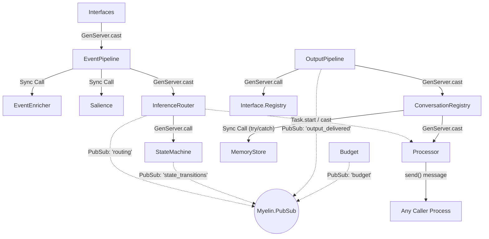

# Module Interaction Patterns

This document details the communication mechanisms, data flows, and concurrency patterns between the core components of the Myelin system.

## 1. Major Module Pair Communications

- **`EventPipeline` -> `InferenceRouter`**
  - **Mechanism:** Async (`GenServer.cast` via `InferenceRouter.route_event/3`).
  - **Data Flow:** Passes the enriched `%Event{}` and its signals dictionary.
- **`InferenceRouter` -> `StateMachine`**
  - **Mechanism:** Sync (`GenServer.call` via `StateMachine.evaluate_event/2`).
  - **Data Flow:** Passes `%Event{}` and the computed `salience_score`. The `StateMachine` acts as a synchronous bridge to process state transitions based on the routing decision.
- **`InferenceRouter` -> `Processor`**
  - **Mechanism:** Async (`GenServer.cast` via `Processor.async/3`).
  - **Data Flow:** Passes a task operation (`:summarize_memories`, `:compress_thread`) speculatively when an event reaches high salience (>= 0.7).
- **`OutputPipeline` -> `Interface.Registry`**
  - **Mechanism:** Sync (`GenServer.call` via `Interface.Registry.get_interface/2`).
  - **Data Flow:** Passes the target interface module to fetch capabilities for constraint and validation checks.
- **`OutputPipeline` -> `ConversationRegistry`**
  - **Mechanism:** Async (`GenServer.cast` via `ConversationRegistry.record_agent_action/2`).
  - **Data Flow:** Passes the `conversation_id` and `%OutputEvent{}` to log the agent's turn and potentially upgrade the thread tracking level.
- **`ConversationRegistry` -> `MemoryStore`**
  - **Mechanism:** Sync (Direct function calls).
  - **Data Flow:** Passes `%Conversation{}` structs for persistence (`upsert_conversation`) or queries for thread resurrection (`lookup_conversation`).
- **`ConversationRegistry` -> `Processor`**
  - **Mechanism:** Async (`GenServer.cast` via `Processor.async/3`).
  - **Data Flow:** Passes the `:summarize_conversation` operation instruction when closing/archiving an idle conversation.

## 2. PubSub Topics

Myelin utilizes `Elixir.Registry` as a local PubSub dispatcher (registered as `Myelin.PubSub`).

- **`"routing"`**
  - **Publisher:** `InferenceRouter`
  - **Message:** `{:routing_decision, event, action, reason}`
  - **Subscribers:** Any interested processes (typically loggers or debugging tools; note that `StateMachine` is called synchronously before this emit).
- **`"state_transitions"`**
  - **Publisher:** `StateMachine`
  - **Message:** `{:state_changed, old_state, new_state_atom, reason}`
  - **Subscribers:** Modules managing context boundaries or UI components reacting to the agent's posture changes.
- **`"output_delivered"`**
  - **Publisher:** `OutputPipeline`
  - **Message:** `{:output_delivered, event_id, receipt_or_error}`
  - **Subscribers:** Internal systems or APIs awaiting delivery confirmations for feedback loops.
- **`"budget"`**
  - **Publisher:** `Budget`
  - **Message:** `{:budget_alert, level, details}` (e.g., `:warning`, `:critical`)
  - **Subscribers:** Supervisors or alerts managing inference caps.

## 3. Task Patterns

Myelin uses the `Task` module explicitly to balance GenServer responsiveness and heavy lifting.

- **Fire-and-Forget (`Task.start/1`)**
  - **`InferenceRouter`:** Defers its entire routing logic (`do_route_event/3`) into a detached task to keep the `handle_cast` hot path clear. It also uses `Task.start/1` to fire off speculative data prep calls (briefing summaries, thread compression) before routing finishes.
- **Supervised, Unlinked (`Task.Supervisor.async_nolink/2`)**
  - **`Processor`:** Uses `Myelin.TaskSupervisor` to spin up unlinked tasks for local 4B LLM executions. Because they are unlinked but monitored, a timeout or brutal kill does not crash the `Processor` GenServer itself.
  - **Preemption:** Because `Processor` tasks are monitored references, the GenServer can preempt a low-priority speculative task via `Task.shutdown(task, :brutal_kill)` to prioritize a newly queued `:real` priority task immediately. 

## 4. Error Propagation

Errors are confined within the bounds of their execution contexts.

- **Return Values (Clean Validation):** The `OutputPipeline` blocks faulty events early with `{:error, reason}` tuples without throwing exceptions. During physical delivery, errors convert into state changes (`status: :failed`), retaining full history instead of crashing the pipeline.
- **Inference Fallbacks:** The `InferenceRouter` catches errors from `LlamaClient` (e.g., API timeouts) and maps them to safe fallback decisions (`:watch` or `:notable`) to ensure the pipeline isn't broken by transient local SLM issues.
- **Task Crash Management:** The `Processor` monitors its async tasks. If an unlinked inference task unexpectedly crashes, it catches the `{:DOWN, ...}` message and forwards `{:error, reason}` directly to the calling process, allowing graceful recovery while keeping the queue flowing.
- **Persistence Retry (Try/Catch):** The `ConversationRegistry` handles potential SQLite disk lock/timeout errors by wrapping `MemoryStore.upsert_conversation/2` in a `try/catch :exit`. Failed writes remain in a `dirty` MapSet and are retried on the next periodic persistence tick, preventing the ETS registry from panicking.

## 5. Communication Diagram

